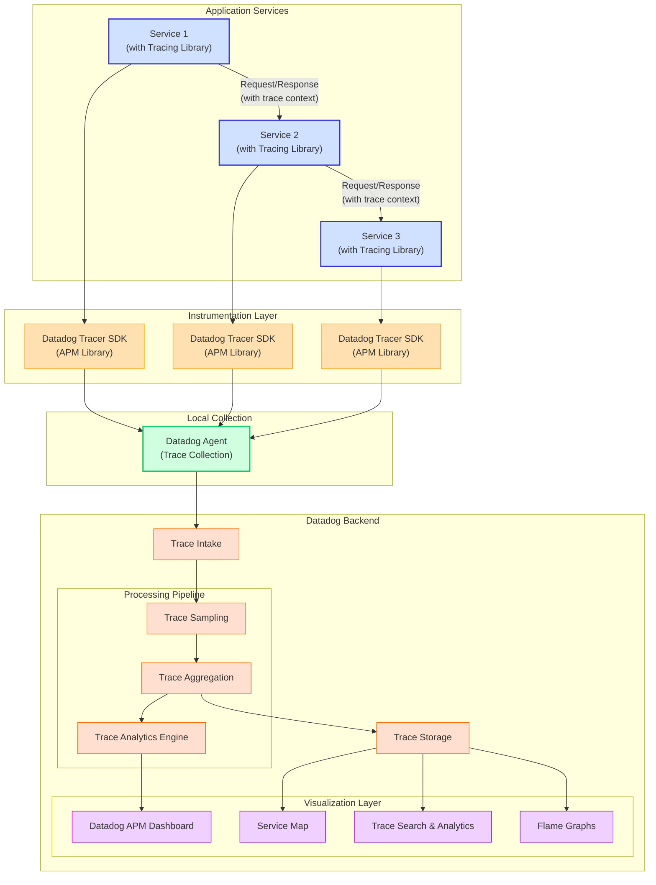

# Distributed Tracing by Datadog with integrated logging on Golang
## Flow-Diagram

## Credits
This flow-diagram was generated with assistance from Claude, an AI assistant by Anthropic.
Code generated on: March 20, 2025
